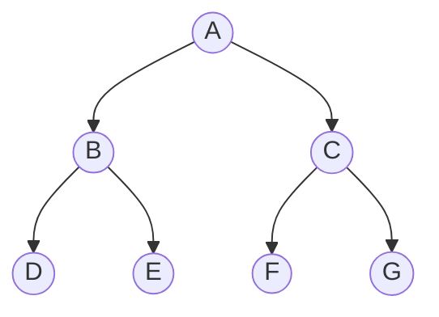
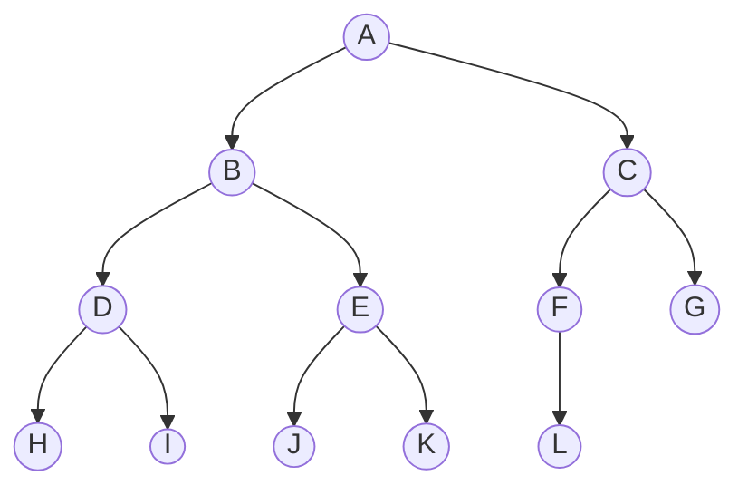
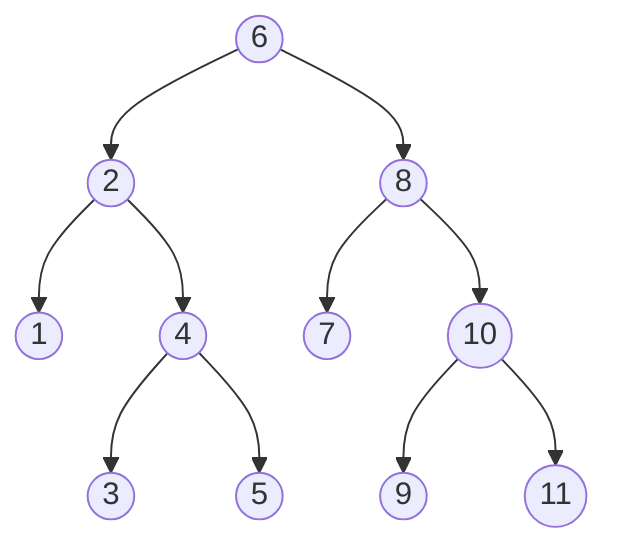
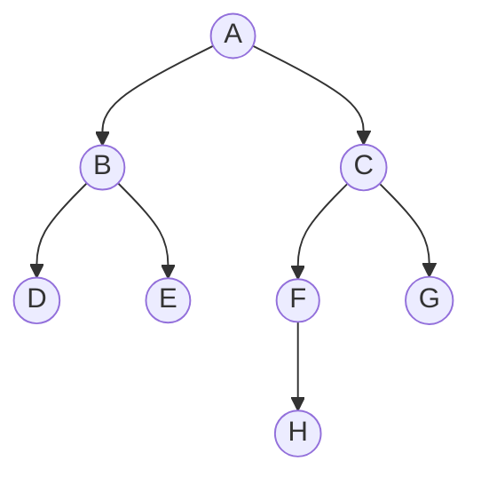

# 二叉树的基本概念
## 基本概念
>二叉树是n（n≥0）个结点的有限集合:
>（1）或者为空二叉树
>（2）或者由一个根结点和两个互不相交的被称为根的左子树和右子树组成，左右子树又分别是一棵二叉树


## 几种特殊二叉树
### 满二叉树
>除最后一层无任何子节点外，每一层上的所有结点都有两个子结点二叉树。

### 完全二叉树
>1）只允许最后一层有空缺结点且空缺在右边，即叶子结点只能在层次最大的两层上出现；
>2）对任一结点，如果其右子树的深度为j，则其左子树的深度必为j或j+1。 即度为1的点只有1个或0个

### 二叉排序树
`二叉排序树（二叉查找树）或者是一颗空树，或者是具有下列特性的二叉树`
>1、就是若它的左子树不空，则左子树上所有节点的值均小于它的根节点的值;
>2、若它的右子树不空，则右子树上所有节点的值均大于其根节点的值。
>3、换句话说就是：**任何节点的键值一定大于其左子树中的每一个节点的键值，并小于其右子树中的每个节点的键值。**

[[二叉排序树]]
### 平衡二叉树
>平衡二叉树也叫AVL树, 它或者是一颗空树，或者具有以下性质的二叉排序树：
>它的左子树和右子树的高度之差(平衡因子)的绝对值不超过1，且它的左子树和右子树都是一颗平衡二叉树。


# 二叉树的性质
>（1）非空二叉树上的叶子结点数等于度为2的结点数加1，即$n_0=n_2+1$
>（2）非空二叉树上第 k 层上至多有$2^{k-1}$个结点
>（3）高度为h的二叉树至多有$2^h-1$个结点
>（4）具有n( n > 0)个结点的完全二叉树的高度为$log_2(n+1)$或$log_2n+1$
>（5）在含有 n 个结点的二叉链表中，含有$n+1$个空链域，含有$n-1$个非空链域

# 二叉树的存储结构
## 顺序存储结构
>指用一组地址连续的存储单元依次自上而下、自左至右存储完全二叉树的结点元素，即将完全二叉树上编号为i的结点元素存储在一维数组下标i-1的分量中

## 链式存储
>用链表结构存储二叉树的每一个结点

| lchild | data | rchild |
| ---- | ---- | ---- |
```C
typedef struct BiTNode {
	ElemType data;
	struct BiTNode *lchild, *rchild;
}BiTNode, *BiTree;
```


# 二叉树的遍历
>二叉树的遍历：按某条搜索路径访问树中每个结点，使得每个结点均被访问一次，而且仅被访问一次

按照先遍历左子树再遍历右子树的原则，常见的遍历次序有`先序（NLR）`、`中序（LNR）`和`后序（LRN）`三种遍历算法
## 先序NLR
>1) 访问根结点
>2) 先序遍历左子树
>3) 先序遍历右子树

```C
void PerOrder (BiTree T) {
	if (T != NULL) {
		visit(T);
		PreOrder (T -> lchild);
		PreOrder (T -> rchild);
	}
}
```
## 中序LNR
>1) 中序遍历左子树
>2) 访问根结点
>3) 中序遍历右子树

```C
void InOrder (BiTree T) {
	if (T != NULL) {
		InOrder (T -> lchild);
		visit(T);
		InOrder (T -> rchild);
	}
}
```

## 后序LRN
>1) 后续遍历左子树
>2) 后续遍历右子树
>3) 访问根结点

```C
void PostOrder (BiTree T) {
	if (T != NULL) {
		PostOrder (T -> lchild);
		PostOrder (T -> rchild);
		visit(T);
	}
}
```

## 层次遍历
> 从上至下从左至右遍历二叉树

```C
void LevelOrder (BiTree T) {
	InitQueue(Q);//队列
	BiTNode *p = T;
	EnQueue(Q,p);
	while (!IsEmpty(Q)){
		DeQueue(Q,p);
		vivit(p);
		if(p -> lchild != NULL)
			EnQueue(Q, p -> lchild);
		if(p -> rchild != NULL)
			EnQueue(Q, p -> rchild);
	}
}
```
 