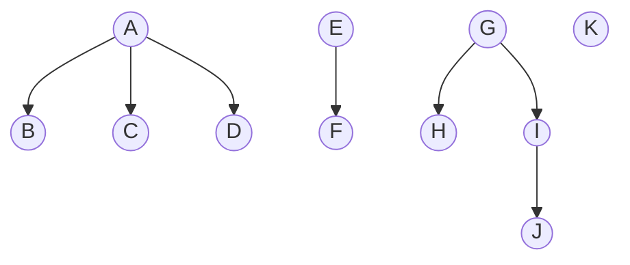

# 树的基本概念
>有$n(n\geq0)$个节点的有限集 

1. `祖先, 双亲, 孩子`
2. `结点的度`: 该结点的孩子个数
4. `树的度`: 树中结点的最大度数
5. `分支结点`: 非终端结点
6. `叶子结点`: 终端结点
7. `兄弟`: 有相同双亲的结点
8. `深度, 高度`: 结点最大层数
9. `有序树`: 有序树树中任意节点的子结点之间有顺序关系
10. `无序树`: 无序树树中任意节点的子结点之间没有顺序关系
11. `路径. 路径长度`: 路径长度是指路径经过的边的条数
## 树的性质
1. 树中的结点数等于所有结点的度数加 1
2. 度为 m 的树中第 i 层上至多有 $m^{i-1}$ 个结点
3. 高度为 h 的 m 叉树至多有$( m^h - 1 ) / ( m - 1 )$个结点
4. 具有 n 个结点的 m 叉树的最小高度为$log_{m} ( n ( m - 1) + 1)$