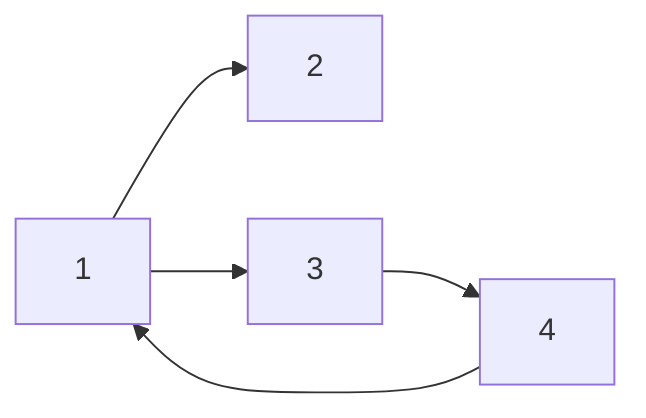
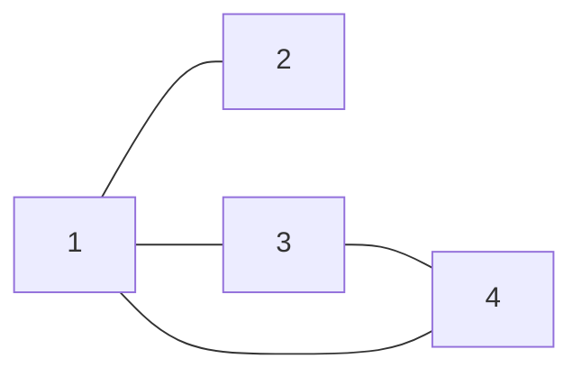
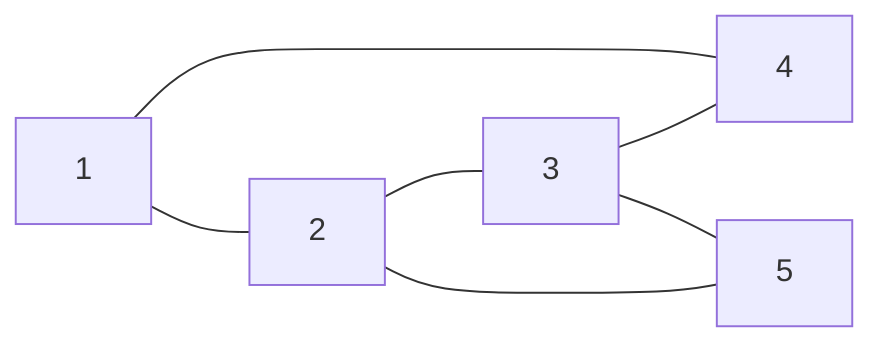
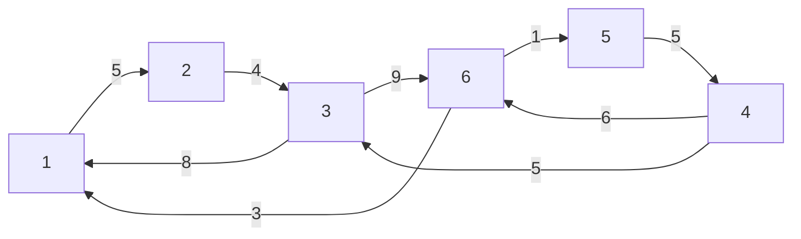

# 图的基本概念

## 有向图
>有方向

## 无向图
>无方向

## 简单图
> 1) 不存在重复边
> 2) 不存在顶点到自身的边 
## 多重图
> 1) 存在重复边
> 2) 存在顶点到自身的边
> 3) 或者说非简单图

## 完全图(简单完全图)
>对于无向图，任意两个顶点之间都存在边
>对于 n 个顶点的无向完全图的边满足: $n\times(n-1)/2$
>
>对于有向图，任意两个顶点之间都存在方向相反的两条弧
>对于 n 个顶点的有向完全图的边满足: $n\times(n-1)$

## 子图和生成子图
### 子图
>顶点集合是一图的子集, 边集合也为其子集, 则为该图的子图
### 生成子图
>顶点图相等但边集是一图的子集, 则为该图的生成子图

## 连通和连通图
### 连通图
>图中任意两个顶点都是连通的
### 极小联通图
>既要保持图连通又要使得边数最少的子图
## 生成树
>包含图中全部顶点的一个极小连通子图

## 顶点的度
>对于无向图: 顶点的度等于顶点所连的边的条数
>`无向图的全部顶点的度的和等于边数的两倍`
>
>对于有向图:
>`入度`: 以顶点 v 为终点的有向边的数目
>`出度`: 以顶点 v 为起点的有向边的数目
>`顶点的度等于入度和出度之和`
>`有向图的全部顶点的入度之和与出度之和相等，并且等于边数`

## 边的权和网
>`权`: 一般指路径的权重(长度)
>`网`: 带权图

## 路径, 路径长度和回路
>`路径`: 点到点所经过的边和点
>`路径长度`: 点到点所经过的路径长度
>`回路`: 环

# 图的存储结构
图的存储结构有四种：`邻接矩阵法`、`邻接表法`、`十字链表法`、`邻接多重表法`
## 邻接矩阵法
$$
A[i][j]=\left\{ \begin{matrix} 1 \qquad (v_i,V_j)或<v_i,v_j>存在 \\ \quad 0 \qquad (v_i,V_j)或<v_i,v_j>不存在 \end{matrix} \right. 
$$

对于无向图来说: 

$$
\begin{bmatrix} 0&1&0&1&0  \\ 1&0&1&0&1 \\ 0&1&0&1&1 \\ 1&0&1&0&0 \\ 0&1&1&0&0\end{bmatrix} \quad
$$
`无向图的邻接矩阵为对称矩阵`

对于有向图来说: 

$$
\begin{bmatrix} 0&1&1&0  \\ 0&0&0&0 \\ 0&0&0&1 \\ 1&0&0&0 \end{bmatrix} \quad
$$

对于带权图来说: 
$$
A[i][j]=\left\{ \begin{matrix} w_{ij} \qquad (v_i,V_j)或<v_i,v_j>存在 \\  0或\infty \qquad (v_i,V_j)或<v_i,v_j>不存在 \end{matrix} \right. 
$$

$$
\begin{bmatrix} \infty&5&\infty&\infty&\infty&\infty  \\ \infty&\infty&4&\infty&\infty&\infty  \\ 8&\infty&\infty&\infty&\infty&9 \\ \infty&\infty&5&\infty&\infty&6 \\ \infty&\infty&\infty&5&\infty&\infty \\ 3&\infty&\infty&\infty&1&\infty \end{bmatrix} \quad
$$ 
## 邻接表法
>图的邻接表存储表示法具有以下特点：
>1)  若G 为无向图, 则所需的存储空间为 O(IVI + 2IEI)
>若 G 为有向图, 则所需的存储空间为 O(IVI+ IEI)2）
>2) 对于稀疏图，采用邻接表表示能极大地节省存储空间
>3) 图的邻接表表示不唯一
>4) 在有向图的邻接表表示中，求一个给定顶点的出度只需计算其邻接表中的结点个数

| 顶点域 | 边表头指针 |
| ---- | ---- |
| data | firstarc |

| 邻接点域 | 指针域 |
| ---- | ---- |
| adjvex | nextarc |
无向图:
![[邻接表法无向图.png]]

所需要的存储空间: `O(|V| + 2|E|)` V:顶点 E:边
有向图:
![[邻接表法有向图.png]]所需要的存储空间: `O(|V| + |E|)` V:顶点 E:边

# 图的遍历
>图的遍历：从图中的某一顶点出发，按照某种搜索方法沿着图中的所有顶点访问一次且仅访问一次图的
>遍历算法主要有两种：`广度优先搜索`和`深度优先搜索`

## 广度优先搜索
>类似于二叉树的层序遍历算法
>遍历结果不唯一
>`遇到分叉路口回头`

## 深度优先搜索
>类似于树的先序遍历
>遍历结果不唯一
>`遇到无路可走的情况再回头`

